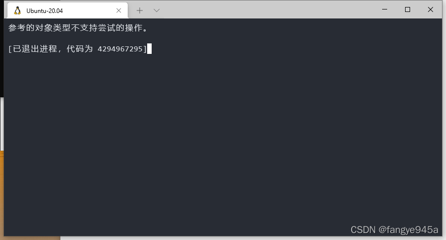
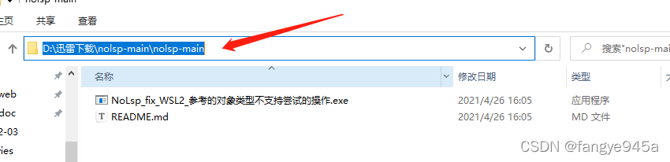
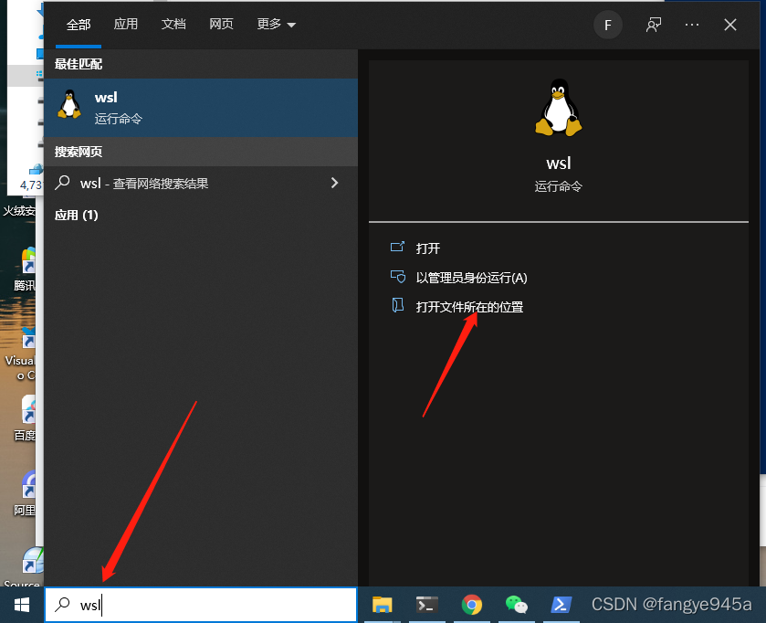
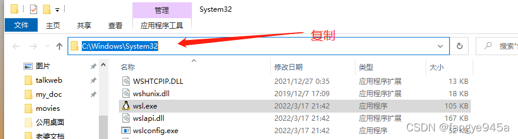
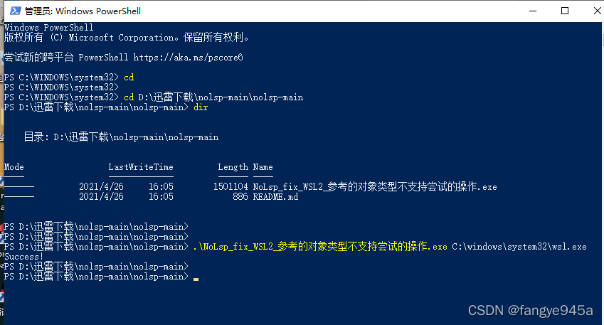
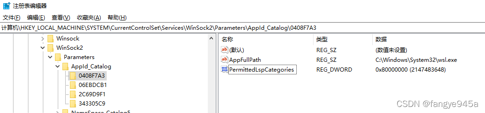

# WSL2启动时提示：参考的对象类型不支持尝试的操作

最近每次开机后打开WSL2时，都会出现参考的对象类型不支持尝试的操作的提示：

**在网上找到一种解决方式是：**

管理员权限打开Powershell，输入如下命令:

	netsh winsock reset

但是这种方法只能暂时解决问题，使WSL能够正常启动，下一次开机时，打开WSL时还是会提示同样的错误。

**原因分析及解决办法：**

WSL是微软的开源项目，在GitHub上[WSL项目ISSUE](https://github.com/microsoft/WSL/issues/4177#issuecomment-641984962)中找到了造成这个问题的原因和解决办法，中文版的翻译如下：

- 显然，如果Winsock LSP DLL被加载到其进程中，则wsl.exe将显示此错误。
- 最简单的解决方案是对wsl.exe使用WSCSetApplicationCategory WinAPI调用来防止这种情况。
- 在幕后，该调用在HKEY_LOCAL_MACHINE\SYSTEM\CurrentControlSet\Services\WinSock2\Parameters\AppId_Catalog中为wsl.exe创建一个条目。
- 这告诉Windows不要将LSP DLL加载到wsl.exe进程中。
- 我们有一个可以进行此调用的工具：
- www.proxifier.com/tmp/Test20200228/NoLsp.exe
- 请以管理员身份运行，并以wsl.exe的完整路径作为参数：
- NoLsp.exe C:\windows\system32\wsl.exe
- 这已经解决了我的问题。
- 请让我知道它如何为您工作。

但是这个NoLsp.exe下载地址经常访问不了，有大佬已经把这个exe放到github上了，可以自行下载: https://github.com/dyingsu/nolsp

下载下来后，以管理员权限打开powershell，并进入到下载目录：

	cd D:\迅雷下载\nolsp-main\nolsp-main

然后找到wsl的安装目录

复制wsl.exe所在路径名:

在powershell中输入.\NoLsp_fix_WSL2_参考的对象类型不支持尝试的操作.exe C:\windows\system32\wsl.exe,其中wsl.exe的路径需要替换成你自己的安装路径

执行完毕，看到有Success的提示则表示设置成功了。

**Tips:如果github进不去，也可以手动改注册表解决：**

输入Win+R弹出运行框，输入regedit即可快速打开注册表编辑器
我们要修改的注册表路径为：
计算机`\HKEY_LOCAL_MACHINE\SYSTEM\CurrentControlSet\Services\WinSock2\Parameters\AppId_Catalog\0408F7A3`
参数值直接参考下表及下图进行修改:

名称    类型    数据
AppFullPath    字符串值    C:\Windows\System32\wsl.exe
PermittedLspCategories    DWORD(32位)值    0x80000000

————————————————

版权声明：本文为CSDN博主「fangye945a」的原创文章，遵循CC 4.0 BY-SA版权协议，转载请附上原文出处链接及本声明。

原文链接：https://blog.csdn.net/fangye945a/article/details/123832623
