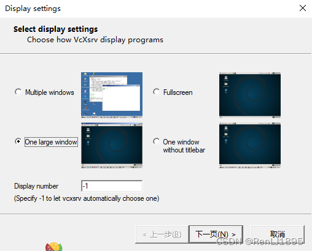

# Win10下安装配置使用WSL2


## Win10 下安装配置WSL2 ##

**1. 检查更新 win10 版本**

在cmd中使用winver命令来检查当前win的版本，如果版本太低，可以在 设置 - 更新和安全 - Windows 更新中更新。但是有时候会没有提示能更新到最新的版本，那就可以使用微软提供的更新助手。

- 对于x64系统: 版本1903 或更好版本, 采用 内部版本18362 或更高版本。
- 对于 ARM64系统: 版本2004 或更高版本, 采用 内部版本19041 或更高版本。

版本要求如上，如果没有别的顾虑，建议升级到最新版。

**2. 启用虚拟功能**

在 powerShell 中以管理员身份运行下面命令以确保开启适用于 Linux 的 Windows 子系统和虚拟机平台配置项。

    dism.exe /online /enable-feature /featurename:Microsoft-Windows-Subsystem-Linux /all /norestart
    dism.exe /online /enable-feature /featurename:VirtualMachinePlatform /all /norestart

运行完成之后，需要重启电脑完成安装。

**3. 下载Linux内核更新程序包**

下载地址：https://wslstorestorage.blob.core.windows.net/wslblob/wsl_update_x64.msi

下载安装即可。

**4. 安装Linux分发版本**

打开微软应用商店，搜索 Ubuntu，在列表中选择最新的长期支持版本 20.04 LTS 并安装启动。

**5. 确保 WSL 的版本为2.0**

使用wsl -l -v命令查看安装版本是否正确（VERSION为2）

如果显示当前不是 WSL 2 版本，可以通过以下命令设置 WSL 的默认版本:

```
# wsl --set-version <Linux发行版名称> 2
wsl --set-version Ubuntu-20.04 2
```

安装成功

```
> wsl -l -v
>   NAME            STATE           VERSION

* Ubuntu-20.04    Running         2
```

## WSL apt换源 ##

**1. 备份源列表**

	sudo cp /etc/apt/sources.list /etc/apt/sources.list.bak

**2. 命令行打开sources.list文件**

	sudo vim /etc/apt/sources.list

**3. 将源文件内容全部注释,并添加以下任意源**

阿里云源

```
deb http://mirrors.aliyun.com/ubuntu/ focal main restricted universe multiverse
deb-src http://mirrors.aliyun.com/ubuntu/ focal main restricted universe multiverse

deb http://mirrors.aliyun.com/ubuntu/ focal-security main restricted universe multiverse
deb-src http://mirrors.aliyun.com/ubuntu/ focal-security main restricted universe multiverse

deb http://mirrors.aliyun.com/ubuntu/ focal-updates main restricted universe multiverse
deb-src http://mirrors.aliyun.com/ubuntu/ focal-updates main restricted universe multiverse

deb http://mirrors.aliyun.com/ubuntu/ focal-proposed main restricted universe multiverse
deb-src http://mirrors.aliyun.com/ubuntu/ focal-proposed main restricted universe multiverse

deb http://mirrors.aliyun.com/ubuntu/ focal-backports main restricted universe multiverse
deb-src http://mirrors.aliyun.com/ubuntu/ focal-backports main restricted universe multiverse
```

清华源

```
deb http://mirrors.tuna.tsinghua.edu.cn/ubuntu/ focal main restricted
deb http://mirrors.tuna.tsinghua.edu.cn/ubuntu/ focal-updates main restricted
deb http://mirrors.tuna.tsinghua.edu.cn/ubuntu/ focal universe
deb http://mirrors.tuna.tsinghua.edu.cn/ubuntu/ focal-updates universe
deb http://mirrors.tuna.tsinghua.edu.cn/ubuntu/ focal multiverse
deb http://mirrors.tuna.tsinghua.edu.cn/ubuntu/ focal-updates multiverse
deb http://mirrors.tuna.tsinghua.edu.cn/ubuntu/ focal-backports main restricted universe multiverse
deb http://mirrors.tuna.tsinghua.edu.cn/ubuntu/ focal-security main restricted
deb http://mirrors.tuna.tsinghua.edu.cn/ubuntu/ focal-security universe
deb http://mirrors.tuna.tsinghua.edu.cn/ubuntu/ focal-security multiverse
```

**4. 保存: ESC + :wq!**

**5. 查看文件是否更改成功**

	cat sources.list

**6. 更新源**

	sudo apt-get update

**7. 更新软件，然后你就可以感受到更换国内源之后的飞速提升了**

    sudo apt-get dist-upgrade
    sudo apt-get upgrade

## WSL2 备份与还原 ##

首先系统必须是 Win10 1903 之后的版本才能用这些命令。

通过按 Win +R，输入 cmd 回车打开命令行窗口输入 wsl -l ,可以看到系统里装了一个 WSL 是 Ubuntu-20.04。

```
C:\Users\huawei>wsl -l
适用于 Linux 的 Windows 子系统分发版: 
Ubuntu-20.04 (默认)
```

输入 wsl --version可以看到版本信息和命令行参数说明

```
C:\Users\huawei>wsl --version
命令行选项无效: --version
版权所有(c) Microsoft Corporation。保留所有权利。

用法: wsl.exe [Argument] [Options...] [CommandLine]

运行 Linux 二进制文件的参数:

    如果未提供命令行，wsl.exe 将启动默认 shell。
    
    --exec, -e <CommandLine>
        在不使用默认 Linux Shell 的情况下执行指定的命令。
    
    --
        按原样传递其余命令行。

选项:
    --cd <Directory>
        将指定目录设置为当前工作目录。
        如果使用了 ~，则将使用 Linux 用户的主页路径。如果路径
        以 / 字符开头，将被解释为绝对 Linux 路径。
        否则，该值一定是绝对 Windows 路径。

    --distribution, -d <Distro>
        运行指定分发。
    
    --user, -u <UserName>
        以指定用户身份运行。

管理适用于 Linux 的 Windows 子系统的参数:

    --help
        显示用法信息。
    
    --install [选项]
        安装额外的适用于 Linux 的 Windows 子系统分发。
         要获得有效分发列表，请使用“wsl --list --online”。
    
        选项:
            --distribution, -d [参数]
                按名称下载并安装分发。
    
                参数:
                    有效分发名称(不区分大小写)。
    
                示例:
                    wsl --install -d Ubuntu
                    wsl --install --distribution Debian
    
    --set-default-version <Version>
        更改新分发的默认安装版本。
    
      --shutdown
         立即终止所有运行的分发及 WSL 2
        轻型工具虚拟机。
    
         --status
           显示适用于 Linux 的 Windows 子系统的状态。
    
    --update [选项]
        如果未指定任何选项，则 WSL 2 内核将更新
        到最新版本。
    
             选项:
         --rollback
                还原到 WSL 2 内核的先前版本。

用于管理适用于 Linux 的 Windows 子系统中的分发的参数:

    --export <Distro> <FileName>
         将分发导出到 tar 文件。
        对于标准输出，文件名可以是 –。
    
    --import <Distro> <InstallLocation> <FileName> [Options]
            将指定的 tar 文件作为新分发导入。
          对于标准输入，文件名可以是 –。
    
        选项:
            --version <Version>
                指定要用于新分发的版本。
    
    --list, -l [Options]
        列出分发。
    
        选项:
            --all
                列出所有分发，包括
        当前正在安装或卸载的分发。
    
            --running
                仅列出当前正在运行的分发。
    
            --quiet, -q
                仅显示分发名称。
    
            --verbose, -v
                显示所有分发的详细信息。
    
            --online, -o
                显示使用“wsl --install”进行安装的可用分发列表。
    
    --set-default, -s <分发>
        将分发设置为默认值。
    
    --set-version <分发> <版本>
        更改指定分发的版本。
    
    --terminate, -t <分发>
        终止指定的分发。
    
    --unregister <分发>
        注销分发并删除根文件系统。

```

`wsl -l` 列出了系统中安装的子系统的名称，可以是一个或多个，本文中的子系统名称是 Ubuntu-20.04，接下来针对这个默认子系统进行操作：

**运行子系统**

```
> wsl --distribution Ubuntu-20.04
> #或者
> wsl -d Ubuntu-20.04
```

**查看运行中的子系统**

```
> wsl -l --running
> Windows Subsystem for Linux Distributions:
> Ubuntu-20.04 (Default)
```

**停止子系统**

```
> wsl -t Ubuntu-20.04
# 或者
> wsl --terminate Ubuntu-20.04
```

**备份子系统**

一定要先停止子系统之后再备份，备份一定要保证硬盘空间充足，

	C:\Users\huawei>wsl --export Ubuntu-20.04 C:\RenL\WSL\Ubuntu-20.04.tar

备份成功后，子系统会被打包成命令中指定的tar文件。

**删除子系统**

删除子系统后，选中的 WSL 就会从 Windows 中干净的删除了。

	> wsl --unregister Ubuntu-20.04

**还原子系统**

删除了没关系，刚才做了备份，可以直接使用命令还原：

	C:\Users\huawei>wsl --import Ubuntu-20.04 C:\WSL C:\RenL\WSL\Ubuntu-20.04.tar 

这里注意指定还原的路径。成功后，子系统又回来了，可以用 wsl -l 确认一下。

**注意：**还原后的子系统进入后，默认成了 root 用户，查了一下，解决方法如下：

1.如果在商店安装过 Ubuntu 直接找到如下目录：

	C:\Users\用户名\AppData\Local\Microsoft\WindowsApps\ubuntu版本.exe

执行指令修改为执行用户:

	C:\Users\huawei>ubuntu2004.exe config --default-user renlj

2.如果电脑上之前没有安装过 WSL，是通过还原来的，可以下载 Windows Terminal 工具，然后进入设置中，指定启动的命令行 -u xxx即可，但是这种方式如果换成其他连接 WSL 的工具还是默认 root 用户。

3.如果还是想要通过 ubuntu.exe config --default-user xxx 这种方式设置默认用户，目前最可靠的方法是下载离线的 Ubuntu WSL 安装包，安装包中就有 ubuntu2004.exe，然后通过这个ubuntu2004.exe 执行 config --default-user xxx 命令，就可以一直默认为设置的用户了，下载链接：https://docs.microsoft.com/en-us/windows/wsl/install-manual

## 配置 Windows Terminal ##

在安装好 WSL 后，最优先的就是下载 Windows Terminal 终端，这个终端的强大之处就不再赘述，但是对于使用 WSL 来说，还需要一些设置才可以更舒适的使用。

**修改WSL默认打开的路径**

打开 Windows Terminal 的设置页面，找到左下方的打开 JSON 文件并使用编辑器打开 setting.json，如果你安装的是 Ubuntu-20.04 ，那么就搜索 Ubuntu-20.04，然后定位到后，添加一行："startingDirectory": "//wsl$/Ubuntu-20.04/home/crazyang"，这样我们再进入 Ubuntu 时，就显示的是 ~ 目录下了。
如下：

```
{
    "guid": "{07b52e3e-de2c-5db4-bd2d-ba144ed6c273}",
    "name": "Ubuntu-20.04",
    "source": "Windows.Terminal.Wsl",
    "startingDirectory": "//wsl$/Ubuntu-20.04/home/crazyang"
}
```

官方文档：https://docs.microsoft.com/en-us/windows/terminal/customize-settings/profile-settings

**修改Ctrl+C 和Ctrl + V**

在 Windows 下，Ctrl + C 默认是复制快捷键，Ctrl + V 默认是粘贴快捷键，但是如果装了 WSL 后，Linux 下 Ctrl + C 是向应用程序发送一个 SIGINT 中断信号，当用户按中断键（Ctrl+C）时，终端驱动程序产生此信号并发送至前台进程组中的每一个进程。这就和 Windows 默认的复制有些冲突，所以建议修改为 Ctrl + Shift + C 和 Ctrl + Shift + V，只需要在和上面相同的 setting.json 配置中：

```
{ "command": {"action": "copy", "singleLine": false }, "keys": "ctrl+shift+c" },
{ "command": "paste", "keys": "ctrl+shift+v" },
```

这样使用起来就更方便了。

## 迁移 WSL 到非系统盘 ##

默认WSL总是安装到C盘，这样对于C盘空间紧张的用户不友好，我们可以使用LxRunOffline工具来迁移WSL到其他磁盘分区。

LxRunOffline的下载链接：https://github.com/DDoSolitary/LxRunOffline/releases。在Win10 PowerShell运行需要下载LxRunOffline-vx.x.x-msvc.zip版本。解压到任意目录即可使用。

LxRunOffline是一个第三方WSL Linux发行版管理工具，可以认为是wsl命令的增强版。它可以安装和卸载Linux发行版，迁移，复制，导入导出和设置环境变量等。具体的使用帮助可执行.\LxRunOffline.exe \h查看命令介绍。

**1. 获取准备迁移的发行版名称**

执行：

	PS C:\Users\xxx\Desktop> .\LxRunOffline.exe list
	Ubuntu-20.04

获取系统当前已安装的发行版。例子中返回的发行版名称为Ubuntu-20.04。

**2. 执行迁移命令**

格式如下：

	.\LxRunOffline.exe m -n <发行版名称> -d <目标路径>

比如我们要将Ubuntu-20.04移动到D:\WSL\Ubuntu-20.04，执行如下命令：

	.\LxRunOffline.exe m -n Ubuntu-20.04 -d D:\WSL\Ubuntu-20.04

等待命令执行完毕返回。

**3. 查看迁移后发行版的安装路径**

执行：

	PS C:\Users\xxx\Desktop> .\LxRunOffline.exe di -n Ubuntu-20.04
	D:\WSL\Ubuntu-20.04

返回的安装位置是D:\WSL\Ubuntu-20.04，说明迁移成功。

## Vmmem进程 ##

**限制Vmmem进程内存占用**

我们可以通过WSL的配置文件，限制Vmmem进程的内存占用。在%UserProfile%目录创建.wslconfig文件，添加如下内容：

```
[wsl2]
memory=6GB
swap=0
localhostForwarding=true
```

这里限制了vmmem进程最大内存不超过6GB，不使用交换空间。
创建完配置文件后，执行wsl --shutdown关闭WSL，再重新启动即可生效。

**关闭虚拟机**

WSL2实际上是在虚拟机中运行。我们一旦进入WSL2 Linux的命令行，虚拟机会自动启动运行。如果我们查看任务管理器，会发现一个Vmmem进程。如下所示：


该进程是虚拟机的进程。它比较占内存。不使用WSL2的时候我们可以关闭它以节省内存。关闭WSL2 Linux的方法如下。使用管理员打开CMD，运行

	wsl --shutdown

## 和宿主Win10 文件系统相互访问 ##

**在 Win10 下访问Linux子系统文件**

打开文件资源管理器，在地址栏输入\\wsl$\Ubuntu-20.04，也可以跳转到Linux子系统根目录。


**在Linux子系统访问Win10文件**

在WSL内 进入 mnt目录

```
renlj@LAPTOP-0FQKQPDJ:$ cd /mnt/
renlj@LAPTOP-0FQKQPDJ:/mnt$ ll
total 8
drwxr-xr-x  4 root root 4096 Jan 28 21:48 ./
drwxr-xr-x 19 root root 4096 Jan 29 10:57 ../
drwxrwxrwx  1 root root 4096 Jan 29 10:56 c/
drwxrwxrwt  2 root root   40 Jan 29 10:56 wsl/
renlj@LAPTOP-0FQKQPDJ:/mnt$ cd c/
```

我的电脑只有一个c盘 所有只显示了 c 和wsl 目录

**解决 systemctl 命令无法使用问题**

现象为在命令行执行systemctl命令，报如下错误：

```
System has not been booted with systemd as init system (PID 1). Can't operate.
Failed to connect to bus: Host is down
```

解决方案如下：

1.安装daemonize和fontconfig

	apt install -y fontconfig daemonize

2.编辑/etc/profile脚本，加入如下内容：

```
SYSTEMD_PID=$(ps -ef | grep '/lib/systemd/systemd --system-unit=basic.target$' | grep -v unshare | awk '{print $2}')

if [ -z "$SYSTEMD_PID" ]; then
   sudo /usr/bin/daemonize /usr/bin/unshare --fork --pid --mount-proc /lib/systemd/systemd --system-unit=basic.target
   SYSTEMD_PID=$(ps -ef | grep '/lib/systemd/systemd --system-unit=basic.target$' | grep -v unshare | awk '{print $2}')
fi

if [ -n "$SYSTEMD_PID" ] && [ "$SYSTEMD_PID" != "1" ]; then
    exec sudo /usr/bin/nsenter -t $SYSTEMD_PID -a su - $LOGNAME
fi
```

3.修改/etc/sudoers文件，加入如下内容：

```
%sudo ALL=(ALL) NOPASSWD: /usr/sbin/daemonize /usr/bin/unshare --fork --pid --mount-proc /lib/systemd/systemd --system-unit=basic.target
%sudo ALL=(ALL) NOPASSWD: /usr/bin/nsenter -t [0-9]* -a su - [a-zA-Z0-9]*
```

4.执行source /etc/profile或者是重新打开terminal，执行systemctl验证是否能够正常操作。

## 安装VcXsrv: WSL 图形化界面 ##

**1. 安装VcXsrv**

安装地址：https://sourceforge.net/projects/vcxsrv/

**2. WSL 安装xface desktop**
```
sudo apt-get install xfce4-terminal
sudo apt-get install xfce4
```

安装过程中会出现要你选择登录界面的选项，选择gdm安装即可。

**3. 配置**

	vim ~/.bashrc

	后面添加

	export DISPLAY="`grep nameserver /etc/resolv.conf | sed 's/nameserver //'`:0"

**4. 打开XLaunch**



一路next


完成之后会跳出一个黑框，表示启动成功。

**5. 启动桌面**

wsl中输入下面命令

	startxfce4


## 参考 ##

[Win10安装WSL - 雪山上的蒲公英 - 博客园 (cnblogs.com)](https://www.cnblogs.com/zjfjava/p/15256606.html)

[为WSL2做快照与回滚_weixin_43425561的博客-CSDN博客_wsl2 快照](https://blog.csdn.net/weixin_43425561/article/details/115765148)

[使用LxRunOffline工具备份/还原WSL_code_peak-CSDN博客_lxrunoffline备份](https://blog.csdn.net/code_peak/article/details/118770932)

[WSL2通过Clash for Windows使用Windows代理 - 静悦时光 - 博客园 (cnblogs.com)](https://www.cnblogs.com/sinicheveen/p/13866914.html)

[Ubuntu 20.04 LTS 安装 Docker_sysin | SYStem INside-CSDN博客_ubuntu20.04安装docker]

————————————————

版权声明：本文为CSDN博主「RenLJ1895」的原创文章，遵循CC 4.0 BY-SA版权协议，转载请附上原文出处链接及本声明。

原文链接：https://blog.csdn.net/RenLJ1895/article/details/122741040
